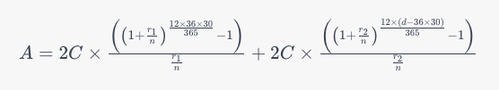

# Bank of Trayt - Compound Interest Calculator

## Instructions
1. git clone into project directory
2. cd into project directory
3. run `npm i`
4. run `npm run dev`

## Implementation Notes
- This project is set up using vite and TypeScript.

- React Router v6.16.0 is used to render the different page contents while keeping the top and side navigation menus the same, for a more SPA experience.

- React Hook Form is used to create the deposit form.

- Cypress is used for E2E testing in `app.cy.ts` and some component testing in `enrollment.cy.ts`
- - run `npx cypress open` to start Cypress testing

- prettier and stylelint were installed for formatting.

- The formula to calculate the compounded interest takes into account that the annual interest rate is 5% for the first 36 months and 2% thereafter. It calculates the total compounded interest based on the frequency of the deposits (1 or 2 times a month), the number of days since enrollment (i.e. when user filled out the enrollment form), and the deposit amount. My process to generate the equation via ChatGPT can be seen [here](https://chat.openai.com/c/ffc3906e-cc5a-47e8-910a-c6b14d530ff3).

### Reason for Using React Hook Form and Not Formik 
React Hook Form has several built-in functionalities and benefits. One benefit is its ability NOT to re-render the form every single time the input changes (e.g. when the user enters just one character), thus reducing loading speed and overhead. 

Unlike Formik, React Hook Form can isolate a component and re-render that component alone, without also rendering other child components along with the form component.

React Hook Form also offers ways to validate the form inputs according to both provided and custom properties. It collects the entire form state into a centralized object that can be passed to other pages.

### Reason for Not Using Material UI to Build the Form
In my opinion, Material UI's major disadvantage is its deeply nested and complicated form structure for form components. Because of this, it can be cumbersome to add even simple custom styling to MUI forms, as the target field can be buried deep inside the form and difficult to locate. Material UI also adds its own lengthy CSS class names to the components, which makes the CSS harder to read and dissect.

### Additional Things I Would Do If I Had More Time
- Increase test coverage (especially of verifying if the returned interest amount is correct).
- Look into integrating vite with React Testing Library for more unit tests.
- Implement React Router in the top and side menus.
- Add a way to navigate to the previous pages.
- Instead of only displaying the calendar, also display an input field so users can type in the desired date, for easier usability.
- Make the page even more responsive by hiding the gray side menu when the viewport shrinks.

